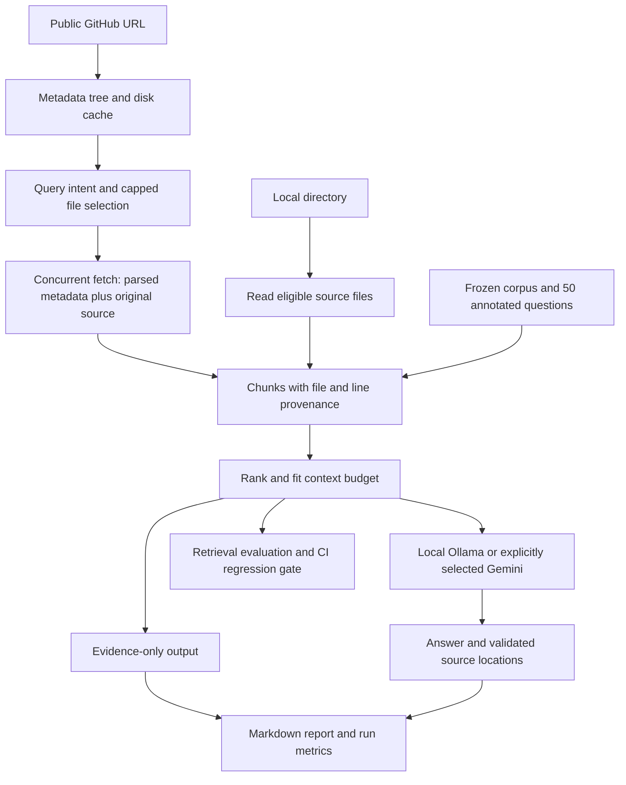

# GitHub Code Analyser

Ask questions about a codebase and inspect the source evidence behind the answer. Runs against public GitHub repositories or local directories, with **local Ollama inference by default** and a model-free evidence mode.

The engineering focus is retrieval quality: preserve executable source, retain file and line references, bound the model's context, and catch retrieval regressions in CI.

## Try it without an API key

Python 3.11 or 3.12 recommended. From this repository:

```bash
python -m venv .venv
# Windows: .venv\Scripts\activate
# macOS/Linux: source .venv/bin/activate
python -m pip install -r requirements-dev.txt

python run_cli.py src --local --retrieval-only --no-report -q "How are cache filenames derived from URLs?"
python -m evaluation.run --check
python -m pytest tests -q
```

Evidence mode prints ranked source excerpts with locations such as `cache/disk_cache.py:L1-L40`. It does **not** generate an AI answer. Neither it nor the lexical benchmark needs a model, API key, or network after dependencies are installed.

## Generate answers locally

Install [Ollama](https://ollama.com/download), start it, and download a model suitable for your RAM:

```bash
ollama pull qwen2.5-coder:3b
python run_cli.py src --local --provider ollama -q "How does the disk cache handle corrupt JSON?"
```

The model name is a starting configuration, not a hardware-specific recommendation. A measured CPU run is documented below. Local inference has no per-call API fees, but uses your machine's memory, electricity, and storage; model downloads require internet access.

For a public GitHub repository:

```bash
python run_cli.py https://github.com/owner/repo -q "Explain the execution flow"
python run_cli.py https://github.com/owner/repo --branch main --refresh-cache --retrieval-only -q "Where is configuration loaded?"
```

GitHub mode needs internet access. `GITHUB_TOKEN` is optional for public repositories and can raise API limits. Private repository support is not validated; use a local checkout for private code. Without `-q`, GitHub mode opens an interactive loop. Local mode answers one question, defaulting to an architecture question.

## Measured retrieval results

The versioned benchmark has **50 source-annotated questions over 33 files from one frozen historical commit** of this repository. All configurations use the same questions, corpus, TF-IDF ranking, and 18,000-character context budget.

| Chunk size / overlap | Top K | File Recall@K | Evidence hit rate | MRR@K |
|---|---:|---:|---:|---:|
| 20 / 4 lines | 5 | 86% | 54% | 0.6663 |
| 20 / 4 lines | 8 | 88% | 60% | 0.6697 |
| 40 / 8 lines | 5 | 86% | 68% | 0.6003 |
| **40 / 8 lines** | **8** | **88%** | **78%** | **0.6037** |

The default retrieved the labeled file for **44/50** questions and an excerpt containing the annotated answer anchor for **39/50**. Twenty-line chunks ranked the right file earlier on average, but more often missed the answer-bearing code. This is why the default uses forty-line chunks.

These are **retrieval metrics, not LLM answer accuracy**. The dataset is an authored regression set, not a blind held-out test; it does not establish performance across unseen repositories. It evaluates retrieval from the full frozen corpus, not GitHub's earlier file-selection stage. The frozen source intentionally contains old implementations; reference answers describe that snapshot.

Read [per-question retrieval results and timings](evaluation/results.json), [benchmark methodology](docs/EVALUATION.md), and [engineering decisions](docs/DECISIONS.md).

```bash
python -m evaluation.run --compare --output reports/comparison.json
python -m evaluation.run --check
```

CI fails if file recall, evidence hit rate, or MRR drops below the checked-in baseline. Dataset and configuration changes require an explicit baseline review. Timing is reported but not gated because CI hardware varies.

## Live local-model baseline

All 50 questions were answered by **Qwen2.5-Coder 3B, Q4_K_M**, through Ollama 0.33.3 on a Ryzen 5 5600H CPU with 15.4 GiB system RAM. No hosted API was used.

| Measure | Observed result |
|---|---:|
| Correct, complete and supported (score 2) | 19/50 (38%) |
| Partially correct (score 1) | 20/50 |
| Incorrect / failed answer (score 0) | 11/50 |
| Mean rubric score | 1.16 / 2 |
| Median / P95 generation wall time | 48.151 / 72.294 seconds |

These are **model-assisted source-review judgments, not independent human validation**. This is one authored regression set, one model, and one run—not a held-out accuracy estimate. The [complete artifact](evaluation/live_answers.json) includes every raw model response, retrieved excerpt, grade and reason.

All 50 answers had valid citation locations, but only 19 received full answer credit. The model never abstained, including on missing-evidence cases. This is a useful baseline with clear weaknesses, not a production-quality claim: source-ID rendering ensures appended locations come from retrieval, not that the prose is true. See [failure analysis and reproduction](docs/EVALUATION.md#published-local-run).

## Architecture



Indexing makes no model calls. Each answered question makes one model request, with a bounded retry policy. Ollama selects source IDs through a JSON schema; the application renders their actual file ranges. Missing evidence triggers abstention and malformed responses fail explicitly. Generic providers use free-form citations with location checks and visible warnings. A valid location is not proof of factual correctness or an automatic fact check.

## Configuration

Copy `.env.example` to `.env` if you want persistent settings. Do not commit keys.

| Setting | Default | Purpose |
|---|---|---|
| `LLM_PROVIDER` / `--provider` | `ollama` | `ollama` or explicitly selected `gemini` |
| `OLLAMA_MODEL` / `--model` | `qwen2.5-coder:3b` | Downloaded local model |
| `OLLAMA_BASE_URL` | `http://localhost:11434` | Loopback server; remote endpoints are rejected |
| `OLLAMA_TIMEOUT` | `120` | Seconds allowed per model request; increase for slow CPUs |
| `GITHUB_TOKEN` | unset | Optional public GitHub access token |
| `TOP_K` / `--top-k` | `8` | Positive number of chunks to retrieve |
| `RETRIEVAL_MODE` / `--retrieval-mode` | `lexical` | `lexical` or optional `semantic` |
| `MAX_SELECTED_FILES` | `20` | GitHub candidate-file cap per question |
| `MAX_SIZE_KB` | `200` | Skip oversized files |
| `MAX_CONCURRENT_FETCHES` | `8` | Concurrent GitHub blob downloads |
| `CACHE_DIR` | `.cache` | GitHub tree and blob cache |

Other flags: `--local`, `--retrieval-only`, `--branch`, `--refresh-cache`, `--no-report`, `--verbose`, `--smoke-test`.

Optional semantic retrieval requires `sentence-transformers` and the `all-MiniLM-L6-v2` model. It fails explicitly if unavailable rather than silently reporting lexical results as semantic. It is not part of the published benchmark comparison.

Optional Gemini support:

```bash
python -m pip install -r requirements-gemini.txt
# Set GOOGLE_API_KEY (or GEMINI_API_KEY) in your environment / .env.
python run_cli.py src --local --provider gemini -q "Explain caching"
```

Gemini sends selected source excerpts to Google's API and may incur charges. Local mode never automatically falls back to a hosted provider.

## Evaluate answer quality

After starting a local model:

```bash
python -m evaluation.answers --model qwen2.5-coder:3b --output reports/answer-review.json
# Declare reviewer_type, then fill each score (0, 1, or 2) and reviewer_reason.
python -m evaluation.answers --score reports/answer-review.json
```

Unreviewed or partial results cannot be reported as accuracy by the scorer. See the [grading rubric](docs/EVALUATION.md#answer-grading).

## Limitations and next experiments

- File selection is heuristic and can miss relevant files in large GitHub repositories. The local path ranks all eligible files, up to a 2,000-file limit.
- GitHub caches are branch-based snapshots. Use `--refresh-cache` when the branch changes; commit-pinned acquisition is future work.
- Local reading skips symlinks, dependency/build directories, hidden directories other than `.github`, `.env*`, unsupported extensions, and oversized files. It is not a secret scanner.
- Source chunking preserves lines but may split functions. Lines over 1,000 characters are truncated. The context budget is characters, not an exact tokenizer count.
- No hybrid search, reranking, PR review, code execution, autonomous fixes, or security-audit capability is claimed.
- Further evaluation should add independently annotated repositories, hard negatives, and blind answer grading before claiming general accuracy or productivity gains.

For a short walkthrough and interview preparation, see [DEMO.md](docs/DEMO.md).
