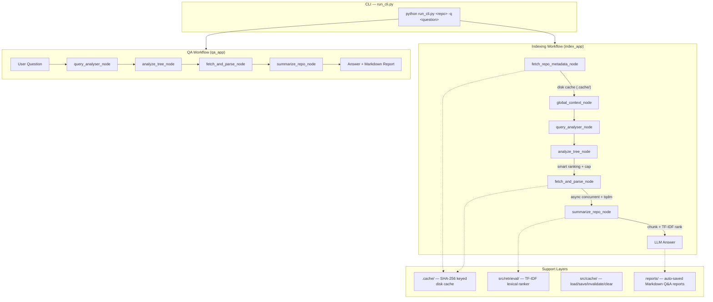

# GitHub Code-Analyser Agent for Developer Productivity

[](https://github.com/Adityabaskati-weeb/GitHub-Code-Analyser-Agent-for-Developer-Productivity/actions/workflows/ci.yml)
[](https://www.python.org/downloads/)
[](LICENSE)

> **Point it at any public GitHub repo, ask a question, get a precise developer answer — in seconds.**

A LangGraph-powered CLI agent that indexes a GitHub repository, selects the most relevant files using query-aware analysis, ranks content chunks by semantic relevance, and answers developer-productivity questions about architecture, pipelines, functions, directories, and implementation details.

---

## Architecture



---

## Key Features

| Feature | Details |
|---|---|
| **Smart file selection** | Scores every file by relevance (intent + keywords + name + depth); caps at `MAX_SELECTED_FILES=20`; skips minified, binary, fonts, oversized files |
| **Concurrent file fetching** | `asyncio.gather` + `asyncio.Semaphore` — up to 8 files fetched in parallel; deterministic output order |
| **tqdm progress bar** | Live fetch progress on terminal; auto-suppressed in CI and piped output |
| **Disk cache** | SHA-256 keyed cache under `.cache/`; `--refresh-cache` to bypass; covers tree, blobs, and global-context snippets |
| **Semantic retrieval** | TF-IDF lexical ranking (stdlib, zero extra deps); optional `sentence-transformers` semantic mode |
| **Markdown reports** | Auto-saved to `reports/` after every answer — one-shot and interactive modes |
| **Query-aware intent** | Detects 5 intent types (pipeline, function, type, directory, architecture) and adjusts file scoring |
| **Python AST parser** | Extracts imports, classes, functions, docstrings — never sends raw code noise to the LLM |
| **Multi-file parsers** | Python (AST), Markdown, JSON/YAML, Jupyter notebooks |
| **Default-branch detection** | Auto-detects `main`/`master`; override with `--branch` |
| **Verbose debug mode** | `--verbose` enables structured `logging.DEBUG` output without touching user-facing `print()` |
| **113 unit tests** | Zero network, zero API key; mocked HTTP; covers parsers, cache, retrieval, selection, fetch |
| **CI tested** | Compile check + pytest + smoke test on Python 3.11 & 3.12 |

---

## Project Structure

```text
run_cli.py                          # CLI entry point
langgraph_app.py                    # LangGraph workflow definitions (index_app, qa_app)
state_schema.py                     # Shared TypedDict graph state
src/
  config/settings.py                # All constants and environment settings
  github_repo_parser.py             # GitHub tree parser (with disk cache)
  cache/
    disk_cache.py                   # SHA-256 keyed filesystem cache (load/save/invalidate/clear)
  retrieval/
    chunker.py                      # Word-boundary text chunker
    ranker.py                       # TF-IDF lexical + optional semantic chunk ranker
  report/
    writer.py                       # Markdown Q&A report exporter
  nodes/
    fetch_repo_metadata_node.py     # Fetches repo tree, passes branch/refresh through state
    global_context_node.py          # Builds high-level repo summary (cached snippet fetches)
    query_analyser_node.py          # Detects intent, keywords, targets from user query
    analyze_repo_node.py            # Smart file scoring, skipping, capping (MAX_SELECTED_FILES)
    fetch_and_parse_node.py         # Async concurrent fetch + tqdm + parser routing
    summarize_repo_node.py          # Chunk, rank, summarise with LLM
  tools/
    parse_python.py                 # AST-based Python parser
    parse_json_yaml.py              # JSON/YAML pretty-printer + truncator
    parse_markdown.py               # Markdown parser
    parse_notebook.py               # Jupyter notebook parser
  utils/
    flatten_tree.py                 # Flatten nested GitHub tree dict to flat list
    fetch_blob.py                   # Cached raw-file fetcher (used by all nodes)
    logger.py                       # Centralised logging (silent by default, --verbose for DEBUG)
tests/                              # 113 unit tests — no network, no API key
  test_github_repo_parser.py        # URL parsing, default-branch detection (14 tests)
  test_flatten_tree.py              # Tree flattening edge cases (10 tests)
  test_parse_python.py              # AST parser + fallback (14 tests)
  test_parse_json_yaml.py           # JSON/YAML parser (9 tests)
  test_query_analyser_node.py       # Intent, keywords, targets (25 tests)
  test_analyze_repo_node.py         # Smart selection, cap, skip, score (19 tests)
  test_fetch_and_parse_node.py      # Concurrent fetch, dedup, order (7 tests)
  test_disk_cache.py                # Cache hit/miss, JSON, invalidate, clear (14 tests)
  test_cli_smoke.py                 # CLI smoke test (1 test)
```

---

## Setup

```bash
# 1. Clone the repo
git clone https://github.com/Adityabaskati-weeb/GitHub-Code-Analyser-Agent-for-Developer-Productivity
cd GitHub-Code-Analyser-Agent-for-Developer-Productivity

# 2. Create a virtual environment
python -m venv .venv
source .venv/bin/activate        # Windows: .venv\Scripts\activate

# 3. Install dependencies
pip install -r requirements.txt

# 4. Configure environment
cp .env.example .env
# Then edit .env and add your keys (see Environment Variables below)
```

---

## Environment Variables

| Variable | Required | Default | Purpose |
|---|---|---|---|
| `GOOGLE_API_KEY` | ✅ | — | Gemini API key — get free at [aistudio.google.com](https://aistudio.google.com/) |
| `GEMINI_API_KEY` | Alternative | — | Alternative Gemini key variable |
| `GITHUB_TOKEN` | Recommended | — | Raises GitHub rate limit from 60 → 5 000 req/hr |
| `GOOGLE_MODEL` | | `gemini-2.5-flash` | Gemini model name |
| `TOP_K` | | `8` | Chunks sent to LLM per question |
| `RETRIEVAL_MODE` | | `lexical` | `lexical` (default) or `semantic` |
| `MAX_SELECTED_FILES` | | `20` | Maximum files selected per query |
| `MAX_SIZE_KB` | | `200` | Skip files larger than this |
| `MAX_CONCURRENT_FETCHES` | | `8` | Parallel file download limit |
| `CACHE_DIR` | | `.cache` | On-disk cache directory |

---

## Example Commands

```bash
# No network, no API key — just checks all parsers work
python run_cli.py --smoke-test

# Interactive Q&A loop (multi-turn, saves a report after each answer)
python run_cli.py https://github.com/owner/repo

# One-shot question
python run_cli.py https://github.com/owner/repo \
    -q "Explain the architecture"

# Analyse a specific branch
python run_cli.py https://github.com/owner/repo \
    --branch develop -q "What changed in the pipeline?"

# Force-refresh the disk cache
python run_cli.py https://github.com/owner/repo \
    --refresh-cache -q "Show the pipeline flow"

# Top-5 chunks, semantic ranking, suppress report
python run_cli.py https://github.com/owner/repo \
    -q "Where is predict() called?" \
    --top-k 5 --retrieval-mode semantic --no-report

# Debug mode — shows all logging output
python run_cli.py https://github.com/owner/repo \
    -q "Explain the data flow" --verbose
```

---

## CLI Reference

```
python run_cli.py <repo_url> [options]

Positional:
  repo_url                 GitHub repo URL: https://github.com/owner/repo

Options:
  -q, --question TEXT      One-shot question (saves Markdown report)
  --branch BRANCH          Git branch to analyse (default: auto-detect)
  --refresh-cache          Bypass disk cache and re-fetch all data
  --top-k N                Chunks sent to LLM per question (default: 8)
  --retrieval-mode MODE    lexical (default) | semantic
  --no-report              Suppress automatic Markdown report export
  --verbose                Enable DEBUG-level logging output
  --smoke-test             Local check — no network or API key needed
  --help                   Show help and exit
```

---

## Sample Output

```
Selected 12/104 files (cap=20, skipped 48 asset/oversized).
Fetching files: 100%|████████████████| 12/12 [00:03<00:00,  3.7 file/s]
Fetched & parsed 12 files (0 from cache).
[retrieval] 64 total chunks -> top 8 selected (mode=lexical)

Agent:

This project is a Flask web application boilerplate...
[full Gemini answer here]

Report saved -> reports\report_20260728T133006Z.md
```

**Second run on the same repo (cache hit):**
```
[cache] Loaded repo tree for owner/repo@main from disk.
Fetching files: 100%|████████████████| 12/12 [00:00<00:00, 247.3 file/s]
Fetched & parsed 0 files (12 from cache).
```

---

## Run Tests

```bash
# Full test suite (no network, no API key)
python -m pytest tests/ -v --tb=short

# Specific module
python -m pytest tests/test_analyze_repo_node.py -v

# Syntax check everything
python -m compileall -q .

# Smoke test (zero dependencies beyond stdlib)
python run_cli.py --smoke-test
```

---

## How File Selection Works

The agent avoids the naive approach of "fetch every file". Instead it:

1. **Hard-skips** minified files (`*.min.js`, `*.min.css`, `*.map`), binary assets (fonts, images), and files > `MAX_SIZE_KB`
2. **Scores** every remaining file with a weighted rubric:

| Signal | Points |
|---|---|
| Name matches important keywords (`readme`, `main`, `config`, …) | +40 |
| Query keyword appears in file path | +20 per hit |
| Intent-specific match (function name, target directory, …) | +25–35 |
| Has a parseable extension (`.py`, `.md`, `.json`, …) | +5 |
| Depth penalty (each `/` in path) | −2 |

3. **Caps** the ranked list at `MAX_SELECTED_FILES=20` — always picks the most relevant files first

---

## Troubleshooting

### `Error: No Gemini API key found`
Add `GOOGLE_API_KEY=<your_key>` to your `.env` file.
Get a free key at [aistudio.google.com](https://aistudio.google.com/).

### `GitHub returned 403 Forbidden`
Add `GITHUB_TOKEN=<token>` to `.env`.
Generate at [github.com/settings/tokens](https://github.com/settings/tokens) — no special scopes needed for public repos.
This raises your rate limit from 60 to 5 000 requests/hr.

### `Repository '...' not found` (404)
The URL must be a public repo in the format `https://github.com/owner/repo`.
Private repos require a `GITHUB_TOKEN` with `repo` scope.

### Large repos take too long (first run)
This is expected on the first run — files are fetched and cached.
**Second and subsequent runs on the same repo are near-instant** (cache hit).
Use `--top-k 5` to send fewer chunks to the LLM and reduce latency.

### `Gemini quota exceeded`
Switch to a lighter model: `GOOGLE_MODEL=gemini-1.5-flash` in `.env`.
Free tier quotas reset daily.

### `ModuleNotFoundError: sentence_transformers`
Semantic retrieval requires an optional dependency:
```bash
pip install sentence-transformers
```
Or keep the default lexical mode: `--retrieval-mode lexical`

### Tests fail with import errors
```bash
pip install -r requirements-dev.txt
```

### Debug unexpected behaviour
```bash
python run_cli.py https://github.com/owner/repo -q "your question" --verbose
```
This enables structured `DEBUG` logging across all nodes.

---

## Development

```bash
# Install dev dependencies (includes pytest)
pip install -r requirements-dev.txt

# Run all tests
python -m pytest tests/ -v

# Check syntax across every Python file
python -m compileall -q .
```
